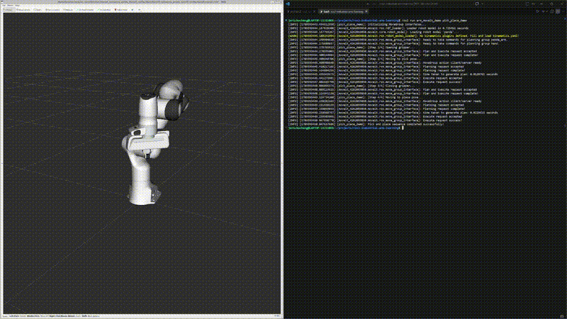

# ROS 2 Industrial Arm — Simulated Pick-and-Place Demo

An 8-week, self-directed learning project: going from **zero C++ experience** to a working **simulated industrial robotic arm pick-and-place demo**, built on ROS 2 (Jazzy) and MoveIt 2.

---

## Demo

*Video/GIF coming soon.*

<!--  -->

The demo runs a Franka Panda arm in simulation through a full pick-and-place sequence: open gripper → move to pick pose → close gripper → move to place pose.

---

## What this project is

Over 8 weeks (roughly 2–3+ hours/day), this project went from:

- **Weeks 1–2**: a C++ crash course for someone who only knew C (RAII, smart pointers, inheritance/polymorphism, lambdas, CMake)
- **Weeks 3–5**: core ROS 2 concepts (nodes, executors, topics, services, actions, tf2, custom interfaces)
- **Week 6**: URDF/XACRO modeling and Gazebo simulation with `ros2_control`
- **Week 7**: motion planning with MoveIt 2, using the official Franka Panda demo
- **Week 8**: integration, debugging tooling (GDB, rosbag2), and the final pick-and-place demo, wired up behind a single launch file

The end result: one command spins up the full simulation stack (robot model, `move_group`, RViz2, controllers) and runs an autonomous 4-step grasp sequence.

---

## Repository structure

```
ros2-industrial-arm-learning/
├── cpp_warmup/              # Week 1-2 standalone C++ practice (no ROS 2 dependency)
├── docs/
│   └── weekly-log/          # Day-by-day learning log, one file per week (week01.md ... week08.md)
└── ros2_ws/                 # Main ROS 2 workspace
    └── src/
        ├── arm_interfaces/      # Custom .action interface definitions
        ├── arm_description/     # URDF/XACRO models (pure assets, no code)
        ├── arm_basics/           # Weeks 3-5 nodes: pub/sub, service, action, tf2 broadcasters
        └── arm_moveit_demo/      # Week 7-8: MoveIt 2 nodes + the final launch file
            ├── src/
            │   ├── first_motion.cpp     # Week 7: first verified MoveIt2 motion (kept as reference)
            │   ├── debug_test.cpp       # Week 8 Day1: intentional segfault, GDB practice
            │   └── pick_place_demo.cpp  # Week 8 Day3: the 4-step grasp sequence node
            └── launch/
                └── pick_place_demo.launch.py   # One-shot launch: sim stack + demo node
```

A separate, git-ignored workspace (`~/ws_moveit`) is used as an **underlay** for MoveIt 2 and the official `moveit_resources_panda_moveit_config` package — this project's own code lives entirely in the `ros2_ws` **overlay** on top of it.

---

## Requirements

- Ubuntu 24.04 (developed under WSL2 with WSLg for GUI support; native Ubuntu works the same way)
- ROS 2 Jazzy
- MoveIt 2 (built from source into a separate `ws_moveit` workspace, following the [official MoveIt 2 tutorials](https://moveit.picknik.ai/))
- `moveit_resources_panda_moveit_config` (comes from the `moveit_resources` repo, part of the MoveIt 2 source build)
- Gazebo (Harmonic) via `ros_gz_sim` / `ros_gz_bridge` for the Week 6 simulation work

---

## Building and running

Both workspaces need to be sourced, in order — the MoveIt 2 underlay first, then this project's overlay:

```bash
source ~/ws_moveit/install/setup.bash
source ~/projects/ros2-industrial-arm-learning/ros2_ws/install/setup.bash
```

Build this project's packages:

```bash
cd ~/projects/ros2-industrial-arm-learning/ros2_ws
colcon build
```

Run the full demo with a single command — this brings up the Panda simulation (RViz2, `move_group`, `robot_state_publisher`, `ros2_control`) and then, once the stack is ready, runs the pick-and-place sequence automatically:

```bash
ros2 launch arm_moveit_demo pick_place_demo.launch.py
```

Expected sequence: RViz2 opens with the Panda arm loaded, a short pause while the simulation stack finishes initializing, then the gripper opens, the arm moves to the pick pose, the gripper closes, and the arm moves to the place pose — logged step-by-step in the terminal.

---

## 8-week learning path

| Week | Focus | Reference |
|---|---|---|
| 1–2 | C++ fundamentals for someone who knows C: RAII, smart pointers, inheritance/polymorphism, lambdas, templates, CMake | Custom crash-course, no textbook |
| 3 | ROS 2 core architecture: colcon, workspaces, packages, nodes, executors | *ROS 2 机器人编程实战*, Ch. 1–2 |
| 4 | Topics, services, launch files, parameters | *ROS 2 机器人编程实战*, Ch. 3–4 |
| 5 | Actions, custom interfaces, tf2 coordinate transforms | *ROS 2 机器人编程实战*, Ch. 5 |
| 6 | URDF/XACRO modeling, Gazebo simulation, `ros2_control` | *ROS 2 智能机器人开发实践*, Ch. 4 |
| 7 | MoveIt 2 motion planning (Franka Panda) | Official MoveIt 2 tutorials |
| 8 | GDB debugging, rosbag2, integration, final demo | *ROS 2 机器人编程实战*, Ch. 6 |

Full day-by-day notes, including every bug and how it was diagnosed, are in `docs/weekly-log/`.

---

## Debugging deep-dives

Eight weeks of a from-scratch project surfaced a lot of real debugging work — not toy exercises. A few of the more involved ones, picked because the root cause took real investigation to find:

### 1. A silently-dropped Gazebo plugin, with zero error output (Week 6)

After wiring up `ros2_control` for the arm, `controller_manager` never appeared — no crash, no error, nothing. The `<plugin>` tag responsible for loading `gz_ros2_control` had been added directly under `<robot>` instead of inside a `<gazebo>...</gazebo>` wrapper (a leftover from manual editing). `sdformat`'s URDF→SDF converter treats an unwrapped `<plugin>` as an unrecognized tag and **silently discards it** — no warning, no log line. It was only found by running the URDF through `gz sdf -p` directly and diffing the expanded SDF against what was expected, confirming the plugin tag never made it through the conversion.

### 2. `robot_state_publisher` aborting with no readable error (Week 6)

A missing `<joint>` tag (dropped by accident during an edit) left three links in the URDF with no parent — three disconnected root links instead of one tree. `robot_state_publisher` builds an internal KDL tree from the URDF, and multiple roots violate a hard assertion inside that library. Instead of a normal ROS error, the process called `abort()` and exited with code `-6`, with nothing printed to explain why. Diagnosing this meant recognizing that a hard crash with no ROS-level error message pointed to a lower-level (KDL) assertion failure rather than a parsing problem, and tracing it back to the URDF's link/joint graph.

### 3. The official Panda demo quietly became a different robot (Week 8)

Following the official `moveit2_tutorials` `demo.launch.py` — the exact tutorial used successfully in Week 7 — suddenly produced an unrelated error about a parameter called `mock_sensor_commands`. Grepping for that string across the workspace found it defined in `kortex_description`, the description package for a **Kinova Gen3** arm. It turned out the `moveit2_tutorials` repo's `main` branch had, between Week 7 and Week 8, switched its default demo configuration from the Franka Panda to a Kinova Gen3 + Robotiq 2F-85 gripper — an upstream change with no relation to anything in this project. The fix was to bypass `moveit2_tutorials` entirely and launch the Panda configuration's own bundled `demo.launch.py`, from the `moveit_resources_panda_moveit_config` package (note: the actual registered package name, not the more intuitive `panda_moveit_config`) — which remained untouched by the upstream change.

### 4. A gripper action that "connects" but doesn't work (Week 8)

With the correct Panda demo running, the arm moved fine, but every gripper command failed with `Plan and Execute request aborted` — no obvious error, request just silently failed at the execution stage. The trail:
- The controller (`panda_hand_controller`) was confirmed active and healthy.
- The real error was buried lower: `Action client not connected to action server: panda_hand_controller/gripper_cmd`.
- Comparing `gripper_moveit_controllers.yaml` (what MoveIt expected: a legacy `GripperCommand` action) against `ros2_controllers.yaml` (what was actually running: `parallel_gripper_action_controller/GripperActionController`, serving `ParallelGripperCommand`) revealed a type mismatch between two files that were supposed to describe the same controller.
- `ros2 action list -t` confirmed it directly — the same action name was listed with **two different types**, one from each side of the mismatch.
- Root cause, confirmed against the upstream MoveIt 2 GitHub history: the `panda_moveit_config` package's gripper configuration hadn't been updated to match ROS 2 Jazzy's newer `parallel_gripper_action_controller`, which replaced the older gripper controller type. The fix was a one-line change (`type: GripperCommand` → `type: ParallelGripperCommand`) in the underlay's config file.

### 5. Launch-time race conditions, and what actually prevents them (Week 8)

The final launch file starts the entire simulation stack and the pick-and-place node together. `LaunchDescription` entries start **concurrently by default** — there's no built-in "wait for the previous action to be ready" behavior. A `TimerAction` was used to delay the demo node's startup by a fixed 6 seconds. In testing, the real safety net turned out to be layered: `TimerAction` only guards against the *worst* case (the stack not having started at all); the actual gap was much tighter than 6 seconds in practice, because `MoveGroupInterface`'s constructor itself blocks until it can connect to each planning group's action server — meaning it tolerates a controller that's still a few hundred milliseconds from being ready, without any extra handling required.

---

## Roadmap (post-8-week)

Ideas for extending this project further, not required for the 8-week MVP:

- Vision-based grasping: camera calibration, OpenCV, and YOLO-based object detection to replace hardcoded pick/place poses
- More complex trajectory planning: obstacle avoidance, Cartesian path planning, MoveIt Task Constructor
- Swapping the Franka Panda for a more "industrial" arm — likely a Universal Robots UR3e/UR5e, with an eye toward real hardware deployment on a student club's collaborative arm
- Unit testing and CI hardening
- Deeper `ros2_control` work: writing a custom hardware interface

---

## Acknowledgments

- *ROS 2 机器人编程实战* — primary ROS 2 curriculum reference (Ch. 1–6)
- *ROS 2 智能机器人开发实践* — URDF/XACRO/Gazebo reference (Ch. 4)
- [MoveIt 2 official tutorials](https://moveit.picknik.ai/) and the [`moveit2_tutorials`](https://github.com/moveit/moveit2_tutorials) / [`moveit_resources`](https://github.com/moveit/moveit_resources) repositories
- [ROS 2 documentation](https://docs.ros.org/en/jazzy/)